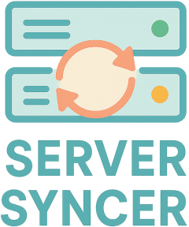

# Server Syncer



Server Syncer is a Go-based utility that keeps MCP configuration files aligned across coding agents such as Copilot, Codex, Claude Code, Gemini, and others. Give it a single template file, and it will convert that configuration into the formats required by each tool while treating one format as the source of truth.

## Getting Started

1. Install Go 1.22 or newer.
2. Run the CLI with a template file and source agent:

   ```bash
   go run ./cmd/server-syncer -template ./configs/codex.json -source codex
   ```

3. The tool will echo the converted configurations for each agent so you can copy them into the appropriate files.

## Configuration

Server Syncer looks for a YAML configuration at one of the platform-specific locations:

- **Linux**: `/etc/server-syncer.yml`
- **macOS**: `/usr/local/etc/server-syncer.yml`
- **Windows**: `C:\ProgramData\server-syncer\config.yml`

You can override this path with `-config <path>`. The file should describe the `source` agent and the list of `targets`. See the [Configuration Guide](configuration.md) for the schema and a sample layout.

## Testing

Run the following command to execute all tests:

```bash
go test ./...
```

## More Information

- [Configuration Guide](configuration.md) - Detailed configuration options
